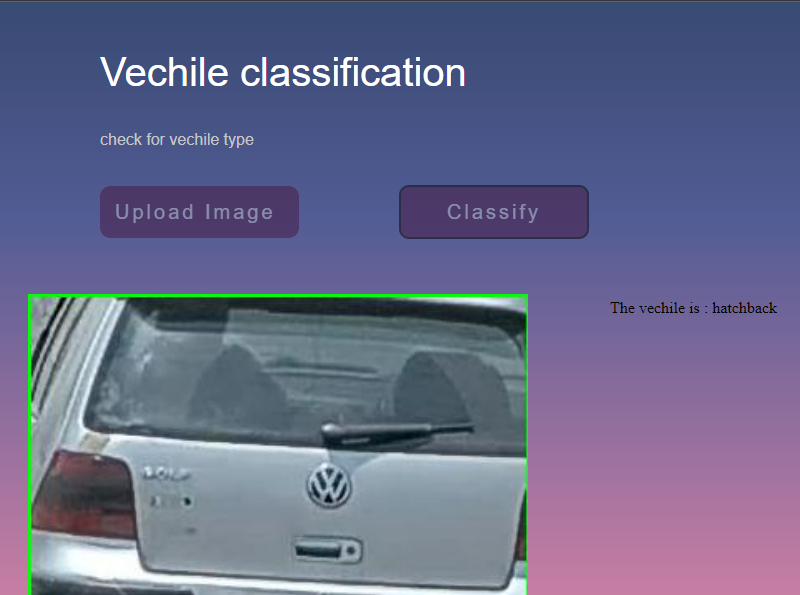
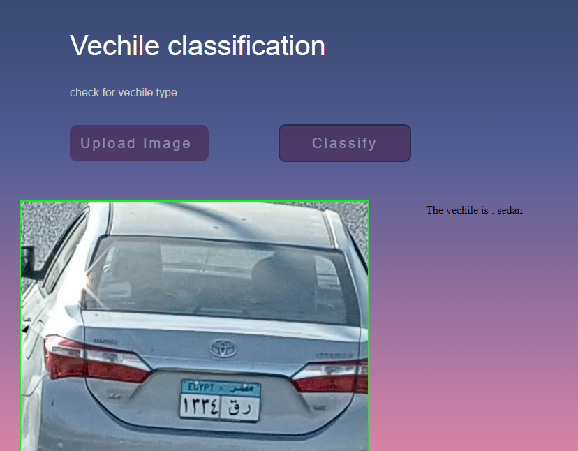
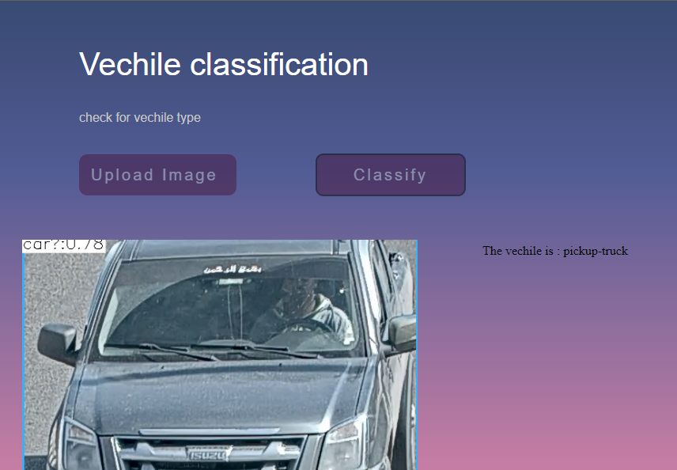

# Vechile classification

## Porject description

A pytorch project to classify the vechile in an image into one of 8 classes using three different models : vgg, resnet and mobilenet.<br>
Each model has a branch containing the training, testing and inference source code.<br>

### output :

The vechile type as one of the following classes.
bus<br>
sedan<br>
hatchback<br>
crossover<br>
pickup-truck<br>
truck<br>
van<br>
motorcycle<br>

### Examples of project running
<p align="center">

</p>
<p align="center">

</p>
<p align="center">

</p>

                                    
### Running the Module with Docker on Windows Machines:

```
docker pull mghrbel/classify-vechile
docker run -d -p 8080:5000 mghrbel/classify-vechile:latest
```
from browser visit :

```
localhost:8080
```

### Running the Module without Docker on Windows Machines:

### Create Virtual Evironment

```
python -m venv <env_name>
<env_name>\Scripts\activate
```

### Install all required libraries
```
pip install -r requirements.txt
```

##### Note : before training or testing make sure that you have this structure of the data directory.<br>
##### Don't worry about augmented_data directory, train script will make it itself.
```
data 
│
└───train
│   │
│   └───original_data
│       │
│       └───bus
│       └───sedan
│       └───crossover
│       └───hatchback
│       └───pickup-truck
│       └───truck
│       └───van
│       └───motorcycle
│   
│   
└───test
│   │
│   └───bus
│   └───sedan
│   └───crossover
│   └───hatchback
│   └───pickup-truck
│   └───truck
│   └───van
│   └───motorcycle
```

### Run the train 
```
python train.py
```

### Run the test 
```
python test.py
```

### Run the inferect without flask api 
```
python classify.py --img <image_path>
```

### Run the inference with flask api
```
python app.py
```


